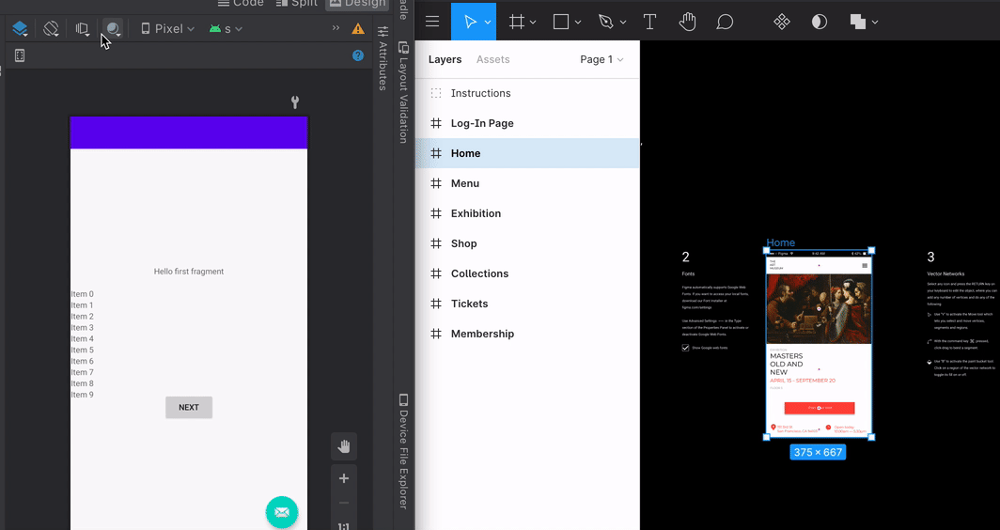

# Android Studio overlay plugin for Figma

This repository contains plugins for Android Studio and Figma to allow displaying a Figma drawing on top of a design layout preview in Android Studio.

The Android Studio plugin uses a new extension point (introduced in Android Studio 4.2) to provide an overlay image. The overlay images is sent over from the Figma plugin.

*Note that the extension point could be used to write plugins for other overlay sources (eg from file system) too. But these two plugins only work with Figma.*

After installing both the Android Studio plugin and the Figma plugin, you will see a new menu for overlays in a layout preview window. You can use that menu to interact with overlays from different overlay providers (in the case of this plugin, Figma overlays).

**This is not an officially supported Google product.**
